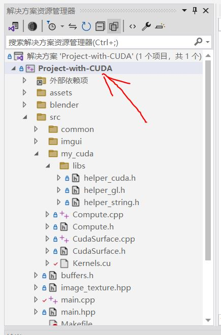
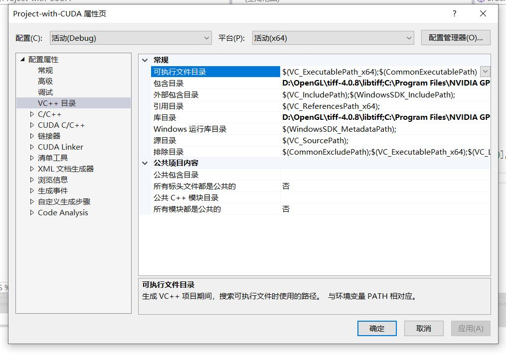
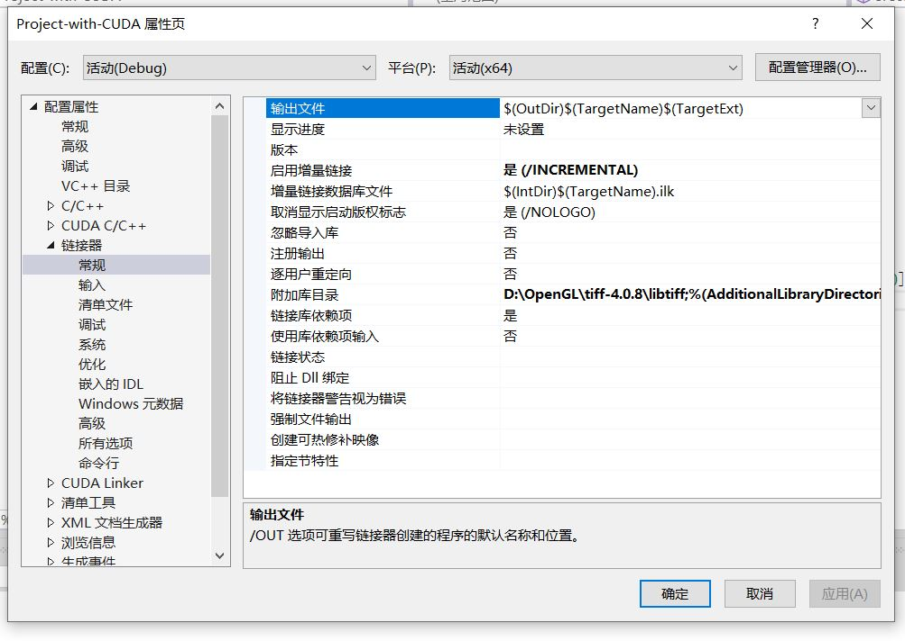
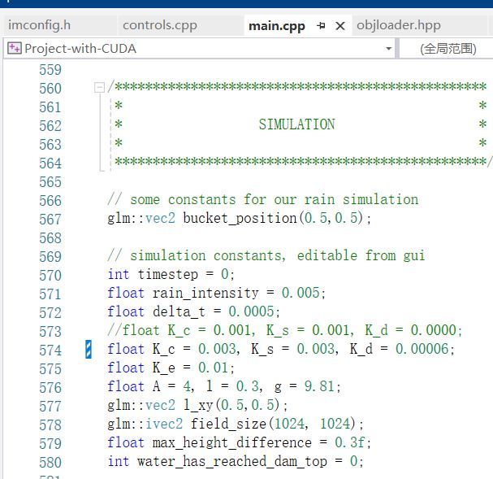
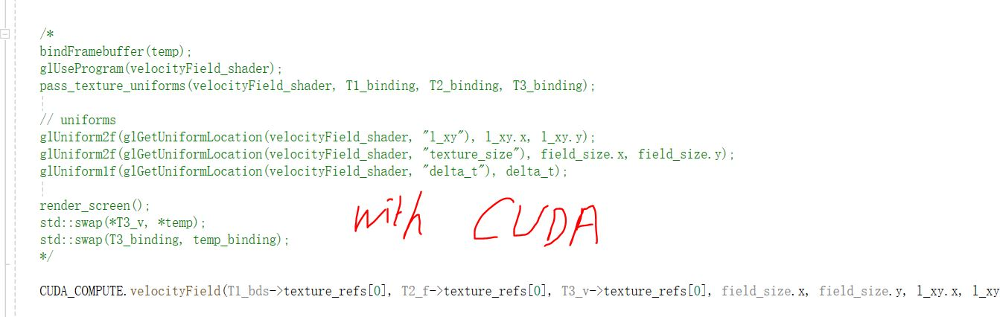
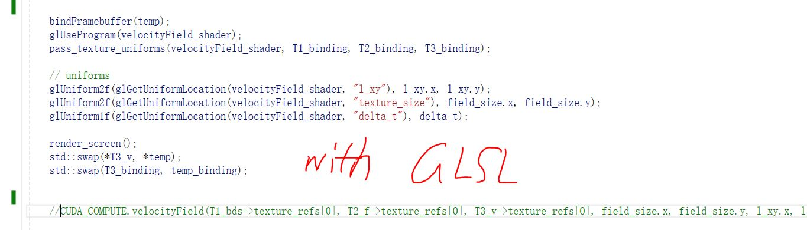
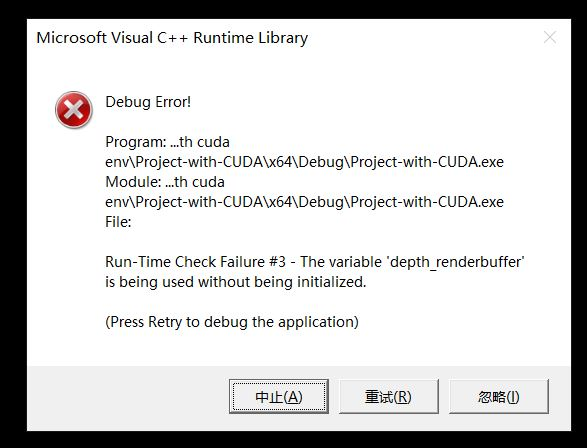
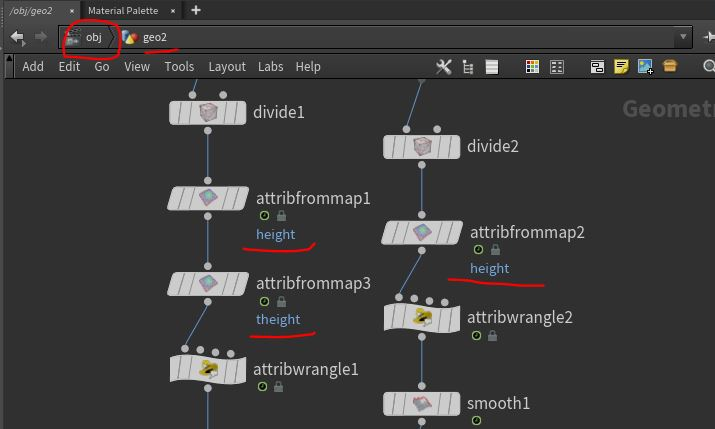
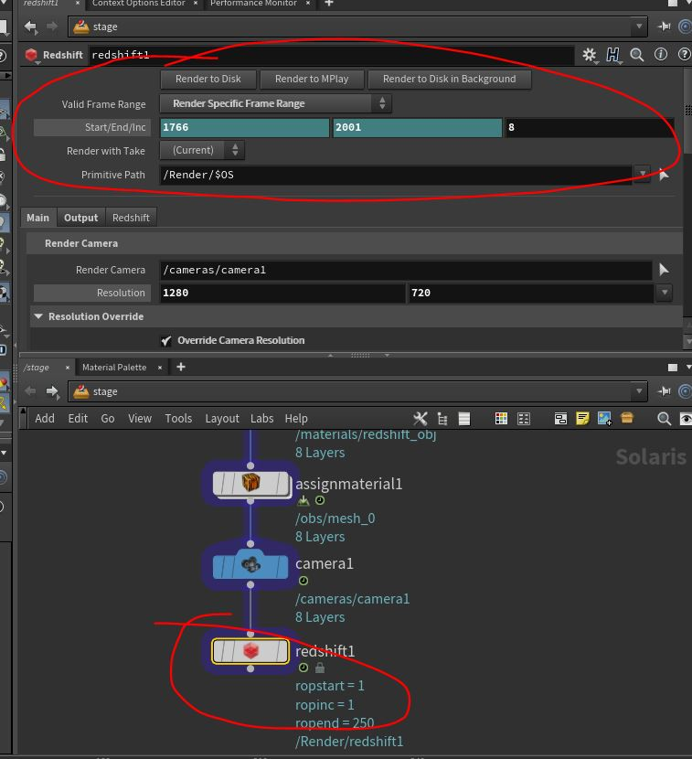

[TOC]

# 水流对地形侵蚀作用的可视化物理仿真

## 说明

由https://huw-man.github.io/Interactive-Erosion-Simulator-on-GPU/的某一个中间版本二次开发，并对其中已观测到的一些bug进行了修复。在保持了原版OpenGL实时渲染特性的同时，增加了CUDA计算部分，数据保存部分，以及一个简单的溃坝控制部分。导出的数据，可以在Houdini上重新建模，并用Redshift渲染。

经过简单的配置，本项目可以运行在Visual Studio 2022上。

我保留了git记录，你可以在Project-with-CUDA中打开git bash，使用git log查看git log。我的提交记录或许对理解程序和流程有一些帮助。

由于特殊原因（其实是我一开始没建立git仓库），只能看到2024.05.16之后的提交记录。

## 依赖库

数据保存：tiff-4.0.8 （实际上，为了适配Houdini，最终版代码并未使用tiff，所以你可以放心移除相关代码），stb

OpenGL框架：glew，glfw3，glad，glm

此外，你还需要：CUDA 12.3，以及与之配套的NVIDIA驱动。各依赖的具体版本，将在“运行环境”详述。

## 运行环境

操作系统：Windows10

GPU：NVIDIA RTX 2060 6GB

RAM：2 * 8GB

并行计算架构：CUDA 12.3

实时渲染框架：OpenGL 3.3

Python 版本：3.9

项目框架语言：C++ 17

图像处理库：stb 2.19

三维建模软件：Houdini 19.5.605

渲染器：Redshift 3.5.17

N卡驱动：552.44

## 运行流程

### 配置环境

#### Visual Studio 2022配置

在Visual Studio 2022中打开“Project-with-CUDA.sln”，可以看到侧边栏如下：



右键Project-with-CUA，点击属性，进入属性面板



需要在**包含目录**和**库目录**中添加项目用到的includes和lib。

为方便管理，这里我选择了将依赖包的includes和lib统一放在了D:\OpenGL下，CUDA相关的包位置在安装时的默认位置C盘。你可以根据你的环境，自行选择路径。

```bash
# 包含目录复制
D:\OpenGL\tiff-4.0.8\libtiff;C:\Program Files\NVIDIA GPU Computing Toolkit\CUDA\v12.3\include;E:\College\Graduation_Design\project\Project-final-test\Project-final-test\src;D:\OpenGL\includes;$(VC_IncludePath);$(WindowsSDK_IncludePath)
```

``` bash
# 库目录复制
D:\OpenGL\tiff-4.0.8\libtiff;C:\Program Files\NVIDIA GPU Computing Toolkit\CUDA\v12.3\lib\x64;D:\OpenGL\lib;$(VC_LibraryPath_x64);$(WindowsSDK_LibraryPath_x64)
```

点击C/C++，复制**附加包含目录**，并修改**警告等级**，取消**将警告视为错误**（VS会阻止过时库的编译运行）。如下：


``` bash
# 复制附加包含目录
D:\OpenGL\tiff-4.0.8\libtiff;%(AdditionalIncludeDirectories);$(CudaToolkitIncludeDir)
# 因为实际上并没有用到tiff，所以你也可以不复制tiff的路径
# 但是CUDA相关的必须要复制
```

同时，你还需要点开**C/C++**目录，找到**预处理器**，修改**预处理器定义**：

``` bash
# 复制预处理器定义
_CRT_SECURE_NO_WARNINGS;_DEBUG;_CONSOLE;%(PreprocessorDefinitions);GLM_ENABLE_EXPERIMENTAL
```

点击侧栏的“链接器”，复制**附加库目录**：



``` bash
# 复制附加库目录
D:\OpenGL\tiff-4.0.8\libtiff;%(AdditionalLibraryDirectories);$(CudaToolkitLibDir)
```

以上步骤完成后，点击“确定”，保存设置并退出。

#### 更新N卡驱动，配置CUDA

如果你已经具有12.3以上的CUDA版本，可以直接运行。否则，需要在NVIDIA官网更新。

### 修改溃坝模块

进入项目的assets/shaders/pipeline，打开erosion_deposition.frag，修改main函数有关侵蚀常数的部分。（带有一些中文注释）

目前只是比较简单的控制了河床、坝体上下游坡面在漫顶前和漫顶后的侵蚀常数，可以实现陡坎漫顶溃坝效果（详见毕业论文）。如果你想要实现更精细的控制，还可以继续添加，并修改侵蚀常数，直到获得满意的结果。

这个shader获得的侵蚀常数，由main.cpp控制：



你可以尝试修改K_c, K_s, K_d, A, l, g, delta_t，观察有什么神奇的效果。

field_size用来调整网格的尺寸。越大越卡。

### 场景初始化与水流侵蚀

整体上，流程如下：

+ 初始化（*）
+ 侵蚀溃坝循环
  1. 更新水通量outflux（*）
  2. 更新水高度waterSurface（*）
  3. 更新速度场velocityField（*）
  4. 更新侵蚀-沉积erosionDeposition
  5. 更新沉积物输运sedimentTransportation（*）

其中，打*的表示已经有CUDA计算程序。侵蚀溃坝循环的所有步骤都有GLSL程序。在这里，我有两个小建议：

+ 如果你需要实时观察溃坝进程，注释掉所有CUDA，取消注释所有OpenGL相关行。我写的CUDA程序，运行速度比原版的GLSL更慢约2~3倍，原因可能是多方面的：1. 我不熟悉CUDA，仅仅能写出CUDA，但不能写出高性能的CUDA。2. CUDA写的比GLSL快，但写出高性能的CUDA，需要投入更多的时间。3. GLSL能更好的适配实时渲染管线，而CUDA仅仅是为了计算服务的。
+ 如果你仅需要计算数值，并另外在渲染器中渲染（就像我后面会做的那样），可以仿照我的程序，另起炉灶，写一个纯CUDA的程序。CUDA写起来真的比GLSL简单很多，且更容易debug，且有更庞大的社区。

main.cpp中的erosion_loop_flat()包含了计算所需的所有流程。其中，调用的函数会有一部分分布在src/my_cuda中。

你可以按下图所示的方式，在使用CUDA/使用GLSL之间做选择。





CUDA_COMPUTE对象拥有一切与CUDA计算有关的函数，例如：CUDA_COMPUTE.initDam()函数执行了坝体的初始化，你在initDam调用前，修改初始场景相关的常数，也可以进入initDam，继续进行更加精细的控制，包括坝体外形等。

其他的函数，详见erosion_loop_flat()函数对CUDA程序的调用链。

### 运行

完成上面的步骤后，你可以打开项目，**Ctrl+F5或点击开始执行（不调试）**，运行程序。

你可能会遇到Debug Error弹窗，点击“忽略”就行，这只是VS对未赋初值的警告，不影响实际使用。



全部忽略后，你可以看到一个简陋的实时渲染结果。


### 后处理

保存计算中每一帧的高度数据（地形高度，水高度），用于Houdini重建和Redshift渲染。使用下面的函数：

``` c++
// main.cpp
SaveOpenGLTextureAsJPG(T1_bds.texture_refs[0], field_size.x, field_size.y, fileName, 0);
```

其中，fileName是保存路径。你需要在一次erosion_loop循环中，调用两次Save函数，分别save地形高度图和水高度图。命名方式详见main.cpp。

高度数据应该导出为灰度图，以便Houdini导入。


保存好之后，Houdini打开flips2_bak32_newnewnew.hip（Special Thanks to Xueguang Xie:cherry_blossom::），如下：



上图所示部分位于Houdini右下部分，点击图中"obj"位置，在弹出的菜单中选择obj，再双击geo2，进入如图所示界面。

单击下图所示节点attribfrommap1，点击上方红圈所在行Reload Texture按钮旁边的图标按钮，浏览并选择我们之前导出的水高度文件夹。

而点击attribfrommap2和attribfrommap3，我们需要导入之前导出的地形高度文件夹。

这里我的地形高度和水高度分别在路径：

``` bash
# 地形高度
F:/0tiffs/jpgs_valley - has parameter controls/cv_terrain_height/output_texture_terrain_b_$F4.jpg
# 水高度
F:/0tiffs/jpgs_valley - has parameter controls/water_height/output_texture_water_d_$F4.jpg
```

其中，地形高度经过了“CV”处理，使用了一个“CV.py” Python脚本，手动平滑了灰度图上的噪点。地形高度会出现噪点的原因待定，原版代码已存在这个问题。我尝试过在计算过程中，从时间和空间上（上下帧平滑、对异常单元格取邻居高度均值）来在计算中平滑噪点，但没有完全消除噪点。时间紧迫，来不及确定原因，故而使用脚本处理了导出的数据。

水高度是没有噪点的。

导入数据后，我们回到“stage”，点击redshift1节点，选择需要渲染的帧，开始渲染吧！



在Adobe Affter Effect 24中，导入渲染好的帧，连接成视频。可以观察到完成的溃坝过程。
